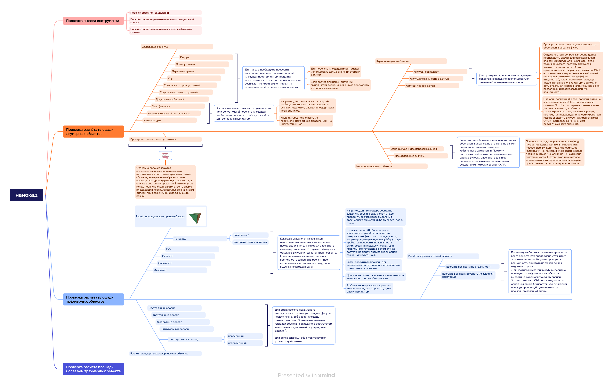
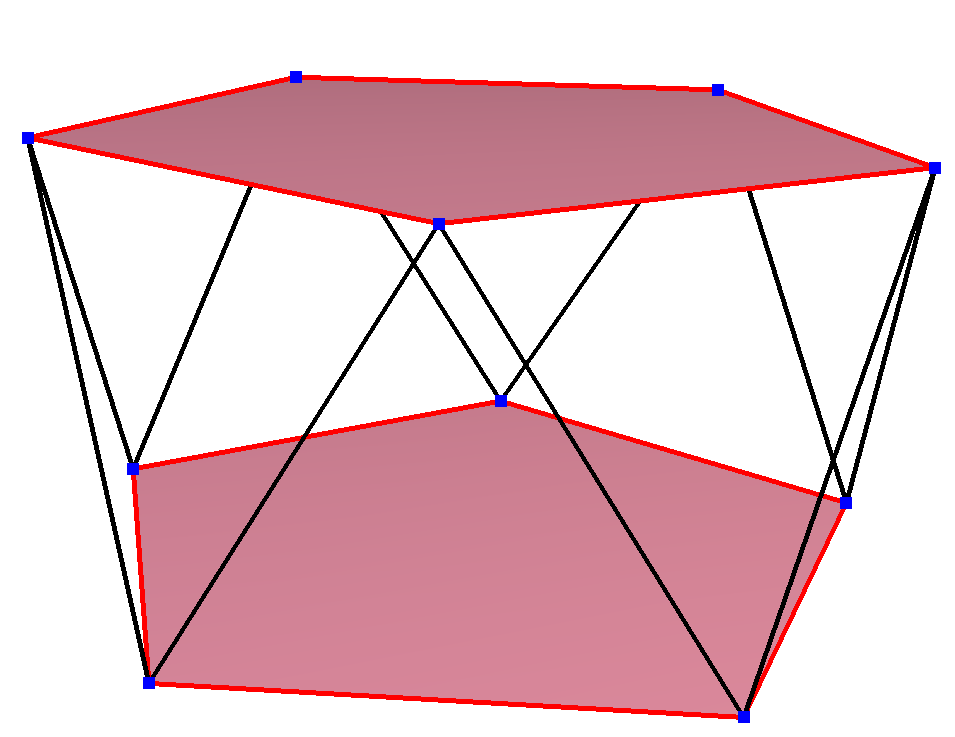
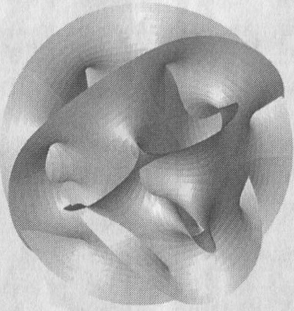

## Оглавление

- [Оглавление](#оглавление)
- [Постановка задачи](#постановка-задачи)
- [Подход к реализации задачи](#подход-к-реализации-задачи)
- [Тестовая модель](#тестовая-модель)
- [Работа с декомпозированными требованиями](#работа-с-декомпозированными-требованиями)
  - [User Story 1](#user-story-1)
    - [Отдельные объекты](#отдельные-объекты)
    - [Пересекающиеся объекты](#пересекающиеся-объекты)
    - [Непересекающиеся объекты](#непересекающиеся-объекты)
    - [Пространственные многоугольники](#пространственные-многоугольники)
  - [User Story 2](#user-story-2)
    - [Все грани объектов](#все-грани-объектов)
    - [Все грани сферических объектов](#все-грани-сферических-объектов)
    - [Выбранные грани объектов](#выбранные-грани-объектов)
  - [User Story 3](#user-story-3)
  - [User Story 4](#user-story-4)
  - [User Story 5](#user-story-5)
  - [User Story  6](#user-story--6)
  - [User Story 7](#user-story-7)
  - [User Story  8](#user-story--8)
- [Заключение](#заключение)

## Постановка задачи 
Необходимо написать эссе на тему "`Как я буду тестировать инструмент подсчёта суммы площадей выделенных объектов чертежа`". 

Сам стиль эссе предполагает более волный подход к изложению, нежели в случае иных подобных документов (например, методика тестирования, план тестирования, etc), что будет учтено ниже. 

## Подход к реализации задачи
Процедура тестирования указанной возможности подсчёта сумм площадей для некой абстрактной САПР включает несколько шагов, при выполнении которых проверяется как правильности подсчёта, так и правильность срабатывания рассматриваемых пунктов меню программы. Тема эссе является по сути переиначенной `User story`, в связи с чем возможно декомпозировать её и перейти к покрытию требований возможными тестовыми сценариями.

Сама история может быть сформулирована `Как инженеру для проведения расчётов мне необходимо подсчитывать сумму площадей объектов, выделяемых на чертеже`. Декомпозировать историю можно по следующим сценариям на последовательность действий:
1. Как инженеру мне необходимо подсчитывать сумму площадей выделенных двумерных объектов
2. Как инженеру мне необходимо подсчитывать сумму площадей выделенных трёхмерных объектов
3. Как инженеру мне необходимо подсчитывать сумму площадей выделенных более чем трёхмерных объектов

Также декомпозировать возможно по операциям:

4. Необходимо рассчитывать сумму площадей непосредственно при выделении объекта
5. Подсчёт суммы площадей выполняется после нажатия специальной кнопки
6. Подсчёт суммы площадей осуществляется после выделения и выбора комбинации клавиш
7. Подсчёт суммы площадей для чертежа, выполненного на другом рабочем месте
8. Подсчёт суммы площадей для чертежа, выполненого в другом, но совместимом САПР

Таким образом определены общие возможности САПР по подсчёту площадей выделенных объектов. Далее каждую из историий возможно либо ещё более глубже декомпозировать, либо составлять возможные тестовые сценарии проверок. Как таковые сценарии мы создавать не будем, а вот пункты проверок совместим с декомпозицией `User story`.

Надо отметить, что из перечисленных требований наиболее важными мы считаем первые три, поэтому особое внимание оным и уделим. 

## Тестовая модель
Для начала разбросаем, какие возможны сценарии поведения при помощи интеллект-карты. Такой подход позволяет оценить горизонт дальнейших работ по дизайну тестов. Скажем, это слегка небрежные путевые заметки, по которым можно далее ориентироваться, когда более детально нужно декомпозировать требования.

Исходя из активностей на интеллект-карте, обозначим два наиболее плотных требования при работе с выделением объектов. Это проверка касательно двумерных объектов (например, параллелипипед) и проверка касательно трёхмерных объектов (наприимер, кубик). На них и сосредоточим свои усилия.

## Работа с декомпозированными требованиями
Итак, одним из важнейших пунктов проверки функционирования инструмента подсчёта суммы площадей является проверка для двумерных фигур. Конечно можно проверить, как площади считаются, также и для одномерных объектов (например, `D0-бран`), но площадь характерна для плоских фигур, что с одномерными объектами слабо стыкуется. Да и как в САПР работать с такого типа бранами не совсем понятно. Поэтому тут не станем останавливаться.

### User Story 1
Требование `Как инженеру мне необходимо подсчитывать сумму площадей выделенных двумерных объектов`

Все проверки покрытия данного требования можно разделить на несколько групп по расположению объектов:
- отдельные
- пересекающиеся
- непересекающиеся
- пространственные многоугольники

#### Отдельные объекты
Для начала необходимо проверить, насколько правильно работает подсчёт площадей простых отдельно-стоящих на чертеже фигур: `квадрата`, `треугольника`, `круга` и т.д. Если вопросов не возникает, то имеет смысл перейти к проверке подсчёта более сложных фигур. Поскольку это эссе, а не тест-план, то расписывать каждую проверку не станем, ограничившись представлением общего подхода к тестированию.

Для подсчёта площадей имеет смысл использовать целые значения сторон/радиуса. Например, площадь прямоугольника рассчитывается по формуле `S = a * b`, где a = 2, b = 5. Таким образом, площадь должна равняться **10**. Если САПР для выделенного на чертеже прямоугольника прямоугольника с указанными длинами сторон показывает это же значение 10, значит подсчёт выполнен верно.

Если _необходимое_ условие подсчёта выполняется, тогда можно перейти к подсчёту площади объекта с дробными значениями сторон. Например, a = 2.5, b = 5.3. Площадь в этом случае должна быть равной **13.25**, что и должно отображаться при выделении объекта на чертеже. В ином случае (предположим, дробные значения не отображаются) можно фиксировать дефект.

Для подсчёта дробных значений также необходимо проверить вариант отображения округлённых значений дробных значений площади. В рассмотренном случая из абзаца выше округление выполняется до сотых (если быть более точным, то оно вовсе не выполняется, а 2.5*5.3 действительно равно 13.25). Но если предположить, что в зависимости от настроек САПР округлять можно только до десятых, тогда на экране при выделении прямоугольника ожидается отображение значения **13.3** (разумеется, в случае, если настройки программы не позволяют округлять в меньшую сторону, что требуется уточнить у аналитиков).  

К перечисленным фигурам, подсчёт площадей которых можно проверить, отнесём следующие (список можно изменять):
- квадрат,
- прямоугольник,
- параллелограм,
- круг,
- треугольник прямоугольный,
- треугольник равносторонний,
- треугольник обычный (с разными сторонами).

Когда выявлена возможность правильного (или допустимого) подсчёта площадей, необходимо рассчитать работу подсчёта для более сложных фигур. Например, `эллипс`, `неравносторонний пятиугольник` или иные фигуры. Например, для пятиугольника подсчёт необходимо выполнить и сравнить с ручным подсчётом, равным площади трёх треугольников, образующих 5-угольник.

Иные фигуры можно взять из перечисленного списка правильных многоугольников https://ru.wikipedia.org/wiki/%D0%A1%D0%BF%D0%B8%D1%81%D0%BE%D0%BA_%D0%BF%D1%80%D0%B0%D0%B2%D0%B8%D0%BB%D1%8C%D0%BD%D1%8B%D1%85_%D0%BC%D0%BD%D0%BE%D0%B3%D0%BE%D0%BC%D0%B5%D1%80%D0%BD%D1%8B%D1%85_%D0%BC%D0%BD%D0%BE%D0%B3%D0%BE%D0%B3%D1%80%D0%B0%D0%BD%D0%BD%D0%B8%D0%BA%D0%BE%D0%B2_%D0%B8_%D1%81%D0%BE%D0%B5%D0%B4%D0%B8%D0%BD%D0%B5%D0%BD%D0%B8%D0%B9#%D0%94%D0%B2%D1%83%D0%BC%D0%B5%D1%80%D0%BD%D0%BE%D0%B5_%D0%BF%D1%80%D0%BE%D1%81%D1%82%D1%80%D0%B0%D0%BD%D1%81%D1%82%D0%B2%D0%BE_(%D0%BC%D0%BD%D0%BE%D0%B3%D0%BE%D1%83%D0%B3%D0%BE%D0%BB%D1%8C%D0%BD%D0%B8%D0%BA%D0%B8). Например, можно рассмотреть пентаграмму , выделив её на чертеже, а затем сравнив с суммой площадей фигур, образующих звезду.

#### Пересекающиеся объекты
Для проверки пересекающихся двумерных объектов необходимо воспользоваться знанием об объединении множеств и рассмотреть три основных сценария проверок:
1. фигуры совпадают
2. фигуры вложены одна в другую
3. фигуры пересекаются

Проверить расчёт площадей возможно для обозначенных ранее простых фигур. 

Отдельно стоит вопрос, как верно должен происходить расчёт для совпадающих и вложенных одну в другую фигур. Тут подход теории множеств "в лоб" не подходит. Поэтому конечно означенное поведение лучше бы уточнить у аналитиков. Мы же предположим, что в рассматриваемой абстрактной САПР есть возможность расчёта как наибольшей площади (_вложенные фигура(ы) не выделяется_), так и нескольких площадей (_выделяются несколько фигур_). 

Возможно есть отдельная кнопка (например, чек-бокс), позволяющий реализовать возможность выделять вложенные фигуры вместе, либо ориентироваться по большей фигуре. Предполагаемый вариант связан с выделением каждой фигуры с помощью клавиши `Ctrl`. В этом случае вложенность не должна сказаться, а объекты рассматриваются априори отдельными, поэтому их площади должны суммироваться. Можно выделять фигуру, нажимая/отжимая `Ctrl`, и наблюдать за изменением результирующего значения.

#### Непересекающиеся объекты
Возможно разобрать все комбинации фигур, обозначенных ранее, но это конечно займёт очень много времени, но не гарантирует полного подтверждения правильности подсчёта суммы площадей. Поэтому достаточно выборочно использовать две разные фигуры, рассчитать для них суммарное значение площади и сравнить с результатом, который вернёт САПР. Всего возможно два сценария:
1. одна фигура + две пересекающиеся
2. две отдельные фигуры

Проверка для двух пересекающихся фигур нужна, поскольку желательно прояснить поведением функции подсчёта суммы со "*сложными*" комбинациями. Поведение везде должно быть одинаковым, но не исключена ситуация, когда фигуры, входящие в класс эквивалентности `пересекающихся`, неверно срабатывают с классом эквивалентности `непересекающихся`.

#### Пространственные многоугольники
Персонально рассматриваются пространственные многоугольники, находящиеся в состоянии вращения. По сути это такие же ранее рассмотренные отдельные двумерные объекты. Таким образом, на чертеже отображаются не проекции фигур на двумерную плоскость, а они же в состоянии вращения. В этом случае метод подсчёта будет заключаться в сверке площади для проекции фигуры со значением фигуры при вращении (они должны быть равны). Пример такого объекта (в данном случае 5-угольника) представлен на рисунке.

Механизм расчёта площади возможно лучше уточнить у аналитиков, но ожидается, что какая бы ни была проекция, значение площади везде одно и тоже. 

### User Story 2
Требование `Как инженеру мне необходимо подсчитывать сумму площадей выделенных трёхмерных объектов`

Все проверки покрытия данного требования можно разделить на несколько групп:
- расчёт площадей всех граней объектов,
- расчёт площадей всех сферических объектов,
- расчёт площадей выбранных граней объекта.

#### Все грани объектов
Как выше указано, отталкиваться необходимо от возможности  выделить несколько фигур (например, с помощью клавиши `Ctrl`), для которых рассчитать суммарную площадь. В случае трёхмерных объектов фигурами являются грани объекта. Поэтому ключевым моментом служит возможность выполнить расчёт выделением всего объекта сразу, либо выделением по каждой грани. Фигура (правильный тетраэдрю) представлена на рисунке

Например, для тетраэдра возможно выделить объект сразу (тем самым проверяется в целом возможность выделения трёхмерного объекта), либо выделить все 4 грани поштучно.

В случае, если САПР предполагает возможность расчёта параметров поверхностей (не только площадь, но и, например, суммарные длины рёбер), тогда требуется проверить правильность суммирования площадей граней. Для правильного тетраэдра в этом случае достаточно подсчитать площадь одной грани и умножить на `4`.

Следующей проверкой служит расчёт площади для неправильного тетраэдра, у которого три грани равны, а одна нет. 

Для других объектов проверки выполняются аналогично и по необходимости. В общем виде проверки сводится к выполненному ранее расчёту сумм различных фигур. 

Возможный набор проверяемых объектов выглядит следующим образом:
1. тетраэдр правильный
2. тетраэдр с тремя равнями гранями
3. куб
4. октаэдр
5. додекаэдр
6. икосаэдр

#### Все грани сферических объектов
Для сферического правильного `шестиугольного осоаэдра` площадь (фигура из двух граней и 6 рёбер) площадь равняется `4пR^2`. Сравнивать значение площади объекта необходимо с результатом вычисления по указанной формуле, зная радиус `R`. 

Предполагается, что выделением таких объектов возможно с помощью отдельной кнопки "**Выделить объект**", как было указано выше. Также возможно выделить объект по граням, если такие предполагаются в объекте. К объектам, подсчёт суммы площадей которых можно проверить, относятся следующие:

1. двуугольный осоэдр 
2. треугольный осоэдр 
3. квадратный осоэдр 
4. пятиугольный осоэдр 
5. шестиугольный осоэдр (правильный)
6. шестиугольный осоэдр (неправильный)

Для более сложных объектов требуется уточнять требования для понимания возможности расчёта площадей их поверхности с последующим сравнением отображения в САПР. 

#### Выбранные грани объектов
Поскольку выбирать грани можно разом для всего объекта (с помощью отдельной кнопки "**Выделить объект**", либо можно уточнить у аналитиков), то необходимо проверить возможность вычитать из общей суммы отдельные грани. 
Для шестигранника (он же `куб`) выделить с помощью этой функции весь объект и вывести на экран общую сумму граней. Затем с помощью `Ctrl` снять выделение с одной из граней. Ожидается, что суммарная площадь граней куба уменьшится на площадь выделенной грани. 

Таким образом, тут предполагается всего две проверки:
1. выбрать все грани по отдельности (проверка должна быть выполнена ранее)
2. выбрать все грани и убрать из выборки выделенные отдельные грани

### User Story 3
Требование `Как инженеру мне необходимо подсчитывать сумму площадей выделенных более чем трёхмерных объектов` 

Предположить, что САПР может строить более чем трёхмерные объекты, довольно сложно. Но предположим, что такая возможность имеется. Это отдельный гипотетический модуль. Методика подсчёта площадей поверхностей объектов в целом походит на представленную в `User Story 2`. Разница заключается в вызове модуля (назовём его `Чертёж многообразия Калаби-Яу`) и отображении многомерных объектов в нём. 

На рисунке представлено изображение _двухмерного «поперечного сечения» шестимерного многообразия Калаби-Яу_

Как подсчитать площадь каждой из отдельных граней подобного объекта сложно представить. Нужно обратиться к разработчикам модуля, либо к струнным теоретикам.

### User Story 4 
Требование `Необходимо рассчитывать сумму площадей непосредственно при выделении объекта`

Покрытие данного требования отчасти было проверено ранее в ходе проверок ещё первой истории. Предполагается, что САПР должен отображать значение площади в строке терминала, либо в выбранной панели. Таким образом, если включён чек-бокс отображения площади (либо может это базовая возможность САПР), при выделении объекта должно отображаться значение рассчитанной площади. 

Как только выделение снимается с объекта, площадь более не отображается. 

По-умолчанию, на чертеже все длины указываются в `мм`. Как дополнительную можно рассмотреть опцию вызова разных единиц исчисления и расчёт площади для каждой из них. Порядок действий следующий:
- выбран объект(ы)
- подсчитана площадь
- выбрана иная единица счисления (например, `м`)
- площадь должна отобразиться в `м^2`

Можно выстроить таблицу с перечислением единиц счисления и действиями `выделено/снято`. Заодно допустимо проверить, как указывалось в `User Story 1`, насколько правильно срабатывает округление при подсчёте площади.

### User Story 5
Требование `Подсчёт суммы площадей выполняется после нажатия специальной кнопки`

Если чек-бокс (или иная кнопка) отображения площади не нажат, тогда при выделении объекта никаких значений не отображается. Проверки в данном случае будут носить следующий характер:
1. кнопка подсчёта суммы не нажата
2. выбран объект(ы)
3. площадь не отображается
4. кнопка нажата
5. площадь рассчитывается

Подобным образом можно проверить двумерные и трёхмерные объекты в комбинации с правилами округления.

### User Story  6
Требование `Подсчёт суммы площадей осуществляется после выделения и выбора комбинации клавиш`

Проверки осуществляются аналогично проверкам для требования выше, разница лишь не в нажатии отдельной кнопки, а в срабатывании переключения комбинации клавиш.

### User Story 7
Требование `Подсчёт суммы площадей для чертежа, выполненого в другом, но совместимом САПР`

Для проверки подсчёта сумм площадей объектов из импортированного чертежа необходимо выполнение условия правильности самого импорта, что здесь не рассматривается. Предполагается, что импорт выполнен успешно, рассматриваемый САПР отображает чертёж, как он есть, а объекты, двумерные и трёхмерные, позволяют выполнять базовые операции с ними (например, вращение). 

Сама операция представляет собой сочетание всех методов, представленных ранее, в зависимости от имеющейся задачи. В самом узком представлении проверить достаточно подсчёт суммы площади для отдельного объекта. Важно убедиться, что сам чертёж из другого приложения позволяет выводить агрегирующие расчёты, такие как сумма площадей.

Отдельно обратить внимание на выставленную в импортированном чертеже систему счисления и правильность подсчёта для системы счисления, выставленной в нашем САПР.

### User Story  8
Требование `Подсчёт суммы площадей для чертежа, выполненного на другом рабочем месте`

В данном случае всё ещё более прозаично, нежели для `User Story 7`. Обратить внимание необходимо, в первую очередь, на возможность подсчитывать площадь, во вторую очередь, на другие системы счисления.

## Заключение
Эссе составлено с учётом постулатов, указанных выше в [Подходе к реализации задачи](#подход-к-реализации-задачи). С помощью данного документа возможно составить детальную методику проведения испытаний (для более широкого спектра функциональных возможностей САПР), либо составить отдельный план тестирования возможности подсчёта сумм площадей для выделенных объектов САПР.